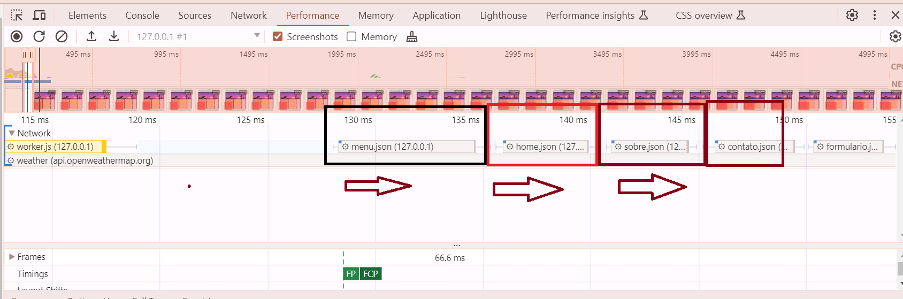
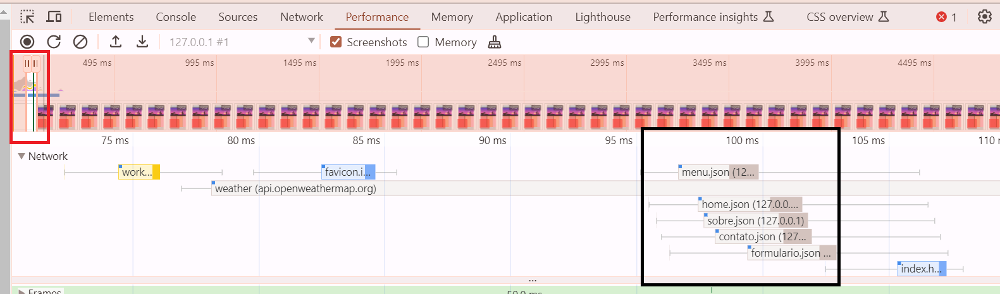

## FastFrame.js: Framework Embrionário para Criação Simplificada de Componentes em JavaScript

**Introdução**
> [!NOTE]
> O `FastFrame.js` é um framework embrionário em JavaScript que visa simplificar a criação de componentes web reutilizáveis e modulares. Através de uma abordagem leve e intuitiva, ele permite que desenvolvedores construam  interfaces dinâmicas e consistentes com menos código e mais facilidade, aproveitando o poder da linguagem JavaScript onde podemos criar o Html e o Css diretamente pelo JavaScript.
> A forma que os objetos eram criados foram transferidos para arquivos json que estão na pasta json na raiz do projeto, isso foi feito para utilizar o web work e nele manter a lógica que faz as requisições paralelas e criam os objetos que serão utilizados no arquivo App.js.
> O modelo atual mostra uma página simples com três páginas no padrão SPA onde os conteudos internos das páginas são criados pela estrutura no arquivo json, isso possibilita a flexibilidade de manuntenção e utiliza a estratégia de cache utilizando o service work, então o uso do web work e service work em conjunto faz o wepapp carregar rapidamente dando ao usuario uma boa experiência de usabilidade.
> esse projeto é apenas um modelo que poderá ser expandido.


> [!IMPORTANT]
> **Estrutura da classe**
> ```
> export default class FastFrame {
>     constructor(objeto) {
>    }
>   
>     adicionarPropriedades() {
>     }
>   
>     adicionarTexto() {
>     }
>   
>     adicionarEventos() {
>     }
>   
>     adicionarEstilo() {
>     }
>   
>     gerarElemento() {
>       this.adicionarPropriedades();
>       this.adicionarTexto();
>       this.adicionarEventos();
>       this.adicionarEstilo();
>   
>       return this.novoElemento;
>     }
>   }
> ```  


> [!NOTE]
> **Fundamentos de Uso**
> 
> Para utilizar o `FastFrame.js`, siga estes passos:
> 
> **1. Crie Objetos de FastFrame:**
> 
> -   Defina um objeto JavaScript que represente o componente desejado, os modelos estão no arquivo componentes.
> -   Inclua propriedades como `tipo`, `id`, `className`, `textContent`, `eventos`, `style` e `holver` em um novo objeto.
> 
> **Exemplo da criação de um botão e um form:**
> 
> 
> ```
> //arquivo formulario.js 
> import * as elementTypes from "../../componentes/TiposElementos.js";
> import * as fabricar from "../../componentes/Fabrica.js";
> 
> const botaoEnvia = {
>   tipo: "button",
>   textContent: "Clique aqui",
>   className: "btn btn-primary",
>   holver: {
>     colorin: "lightblue",
>     colorout: "",
>   },
>   eventos: {
>     click: () => {
>       console.log("Botão clicado!");
>     },
>   },
> };
> 
> const form ={
>     tipo: elementTypes.FORM,
>     id: 'form',
>       style: {
>         display: 'flex',
>         'flex-direction': 'column',
>         'justify-content': 'center',
>         width: 'auto',
>         height: 'auto',
>         border: 'solid 2px red',
>       }
>   }
> 
>  export default function fabricaForm(){
>    const novoform = fabricar.criarContainer(form);
>     const novobotaoEnvia = fabricar.criarContainer(botaoEnvia);
>    
>     novoform.appendChild(novobotaoEnvia)
>     
>     return novoform
>     
>   }
> ```
> 
> 
> ```
> //arquivo contato.js:
> import fabricaForm from "./formulario.js";
> 
> //adiciona no corpo o formulario com o botao já com stylo iline nele
> document.body.appendChild(fabricaForm())
> 
> 
> ```
> 
> 
> **2. Importe e Utilize as Funções:**
> 
> -   Importe as funções `criaElemento` e `criaTabela` do arquivo `FastFrame.js`.
> -   Utilize a função `criaElemento` para criar qualquer elemento HTML a partir de um objeto de componente.
> -   Utilize a função `criaTabela` para criar tabelas dinâmicas com base em dados estruturados.
> 

> [!Warning]
> **Exemplo:**
> 
> ```
> import Elemento from "./FastFrame.js";
> 
> const botao = criaElemento(meuBotao);
> document.body.appendChild(botao);
> 
> const dadosTabela = {
>   th: {
>     nome: "Nome",
>     idade: "Idade",
>   },
>   td: [
>     { nome: "João", idade: 30 },
>     { nome: "Maria", idade: 25 },
>   ],
> };
> 
> const tabela = criaTabela(dadosTabela);
> document.body.appendChild(tabela);
> 
> ```
> 
> **3. Personalização e Extensões:**
> 
> -   Ajuste as propriedades dos objetos de componente para personalizar a aparência e o comportamento dos elementos.
> -   Crie suas próprias funções e classes para estender o framework e atender às suas necessidades específicas.

> [!Caution]
> **Propósito**
> 
> O `FastFrame.js` foi criado com o objetivo de:
> 
> -   **Simplificar a Criação de Componentes:** Reduzir a quantidade de código repetitivo e boilerplate "código que devem ser incluídas em muitos lugares com pouca ou nenhuma alteração" para criar elementos HTML.
> -   **Promover Reutilização:** Facilitar a reutilização de componentes em diferentes partes do seu projeto.
> -   **Melhorar a Modularidade:** Organizar o código em módulos independentes e reutilizáveis.
> -   **Aumentar a Produtividade:** Acelerar o desenvolvimento de interfaces web com menos esforço.
> 
> **Observações Importantes:**
> 
> -   O `FastFrame.js` ainda está em desenvolvimento e pode ter funcionalidades limitadas.
> -   É recomendável utilizar ferramentas de desenvolvimento web para depurar e inspecionar elementos.
> -   Para projetos complexos, considere frameworks mais robustos como React ou Vue.js.
> 
> **Conclusão**
> 
> O `FastFrame.js` é uma ferramenta promissora para desenvolvedores que desejam simplificar a criação de componentes web em JavaScript. Com sua abordagem leve e flexível, ele pode ser um aliado valioso na construção de interfaces dinâmicas e escaláveis.
> 
> 
> Acreditamos que o `FastFrame.js` tem potencial para se tornar uma ferramenta popular e simples para a criação de interfaces web em JavaScript e somente com Javascript. Com o seu feedback e colaboração, podemos torná-lo ainda melhor!
> 
> 
> Melhorias e avanços futuros é criar componentes CSS em javascript para importar nos componentes individuais, mantendo toda estrutura dentro do javascript.
> estou avalindo dois cénarios para o citado logo acima, 1º tem um componete que cria o css dentro dos compoente s na sua criação como funciona hoje, e 2º criar dinâmicamente em cada componete uma forma de criar no head da página o css semelhante ao css externo, mas sem ter css externo, pois este seria criado dinâmicamente quando o componete for criado.
> sinta-se a vontade em colaborar com o projeto com ideias e códigos.

> [!NOTE]
> **Atualizações para melhoria de desempenho 15-06-2024 :**
> adicionado requisições paralelas
> antes:
> 
> depois:
> 


> [!NOTE]
> **Atualizações para melhoria de desempenho 11-07-2024 :*webpack*
> irei deixar a pasta dist pronta para que testem
>
> 
> 1- passo: criar o arquivo package.json, mas nele precisa especificar qual o arquivo javascript principal que é o ponto inicial do sistema 
> 
> ```
> npm init -y
> ```
> 2- passo: instalar as bibliotecas necessarias
> ```
> npm install --save-dev webpack webpack-cli mini-css-extract-plugin html-webpack-plugin  > css-loader style-loader babel-loader @babel/core @babel/preset-env 
> ```
> 3- passo: criar o arquivo webpack na raiz do projeto, "webpack.config.js" com o conteúdo.
> ```
> const path = require('path');
> const MiniCssExtractPlugin = require('mini-css-extract-plugin');
> const HtmlWebpackPlugin = require('html-webpack-plugin');
> 
> module.exports = {
>   entry: './src/js/App.js',  // Arquivo de entrada principal
>  output: {
>     filename: 'App.js',
>     path: path.resolve(__dirname, 'dist'),  // Diretório de saída
>   },
>   module: {
>     rules: [
>       {
>         test: /\.js$/,
>         exclude: /node_modules/,
>         use: {
>           loader: 'babel-loader',
>           options: {
>             presets: ['@babel/preset-env'],
>           },
>         },
>       },
>       {
>         test: /\.css$/,
>         use: [MiniCssExtractPlugin.loader, 'css-loader'],
>       },
>     ],
>   },
>   plugins: [
>     new MiniCssExtractPlugin({
>      filename: 'styles.css',
>     }),
>     new HtmlWebpackPlugin({
>       template: './src/index.html',  // Caminho do seu arquivo HTML
>       filename: 'index.html',  // Nome do arquivo gerado na pasta dist
>     }),
>   ],
>   mode: 'production',
>   devtool: "source-map",
> };
> ```
> 4- passo: o comando para deploy:
> ```
> npm run build
> ```
> no fina lé gerado a pasta dist com todos os arquivos prontos para publicar.