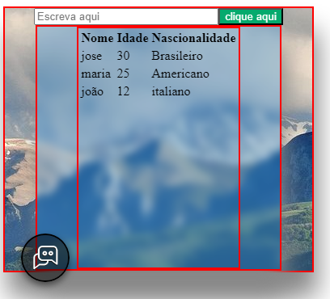

## FastFrame.js: Framework Embrionário para Criação Simplificada de Componentes em JavaScript

**Introdução**

O `FastFrame.js` é um framework embrionário em JavaScript que visa simplificar a criação de componentes web reutilizáveis e modulares. Através de uma abordagem leve e intuitiva, ele permite que desenvolvedores construam interfaces dinâmicas e consistentes com menos código e mais facilidade, aproveitando o poder da linguagem JavaScript onde podemos criar o Html e o Css diretamente pelo JavaScript .

**Fundamentos de Uso**

Para utilizar o `FastFrame.js`, siga estes passos:

**1. Crie Objetos de FastFrame:**

-   Defina um objeto JavaScript que represente o componente desejado, os modelos estão no arquivo componentes.
-   Inclua propriedades como `tipo`, `id`, `className`, `textContent`, `eventos`, `style` e `holver` em um novo objeto.

**Exemplo:**

```
const meuBotao = {
  tipo: "button",
  textContent: "Clique aqui",
  className: "btn btn-primary",
  holver: {
    colorin: "lightblue",
    colorout: "",
  },
  eventos: {
    click: () => {
      console.log("Botão clicado!");
    },
  },
};

```

**2. Importe e Utilize as Funções:**

-   Importe as funções `criaElemento` e `criaTabela` do arquivo `FastFrame.js`.
-   Utilize a função `criaElemento` para criar qualquer elemento HTML a partir de um objeto de componente.
-   Utilize a função `criaTabela` para criar tabelas dinâmicas com base em dados estruturados.

**Exemplo:**

```
import Elemento from "./FastFrame.js";

const botao = criaElemento(meuBotao);
document.body.appendChild(botao);

const dadosTabela = {
  th: {
    nome: "Nome",
    idade: "Idade",
  },
  td: [
    { nome: "João", idade: 30 },
    { nome: "Maria", idade: 25 },
  ],
};

const tabela = criaTabela(dadosTabela);
document.body.appendChild(tabela);

```

**3. Personalização e Extensões:**

-   Ajuste as propriedades dos objetos de componente para personalizar a aparência e o comportamento dos elementos.
-   Crie suas próprias funções e classes para estender o framework e atender às suas necessidades específicas.

**Propósito**

O `FastFrame.js` foi criado com o objetivo de:

-   **Simplificar a Criação de Componentes:** Reduzir a quantidade de código repetitivo e boilerplate "código que devem ser incluídas em muitos lugares com pouca ou nenhuma alteração" para criar elementos HTML.
-   **Promover Reutilização:** Facilitar a reutilização de componentes em diferentes partes do seu projeto.
-   **Melhorar a Modularidade:** Organizar o código em módulos independentes e reutilizáveis.
-   **Aumentar a Produtividade:** Acelerar o desenvolvimento de interfaces web com menos esforço.

**Observações Importantes:**

-   O `FastFrame.js` ainda está em desenvolvimento e pode ter funcionalidades limitadas.
-   É recomendável utilizar ferramentas de desenvolvimento web para depurar e inspecionar elementos.
-   Para projetos complexos, considere frameworks mais robustos como React ou Vue.js.

**Conclusão**

O `FastFrame.js` é uma ferramenta promissora para desenvolvedores que desejam simplificar a criação de componentes web em JavaScript. Com sua abordagem leve e flexível, ele pode ser um aliado valioso na construção de interfaces dinâmicas e escaláveis.


Acreditamos que o `FastFrame.js` tem potencial para se tornar uma ferramenta popular para a criação de interfaces web em JavaScript. Com o seu feedback e colaboração, podemos torná-lo ainda melhor!


o modelo da froma que está 